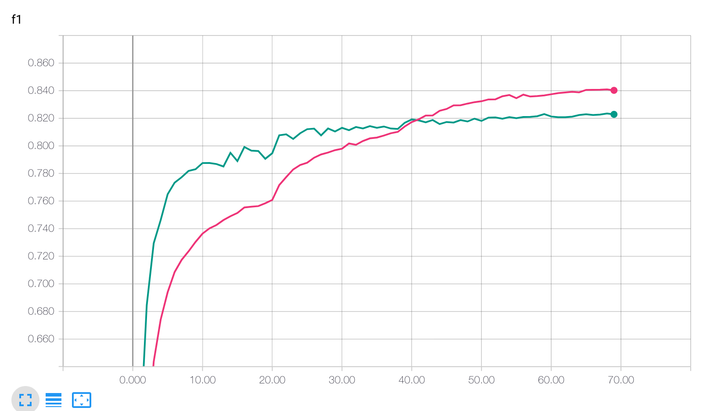
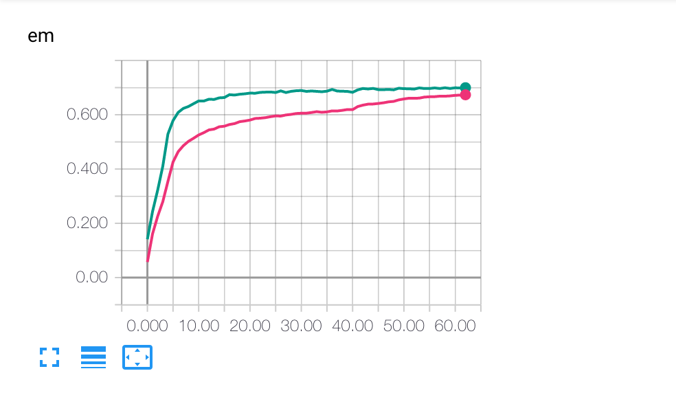

An unofficial implementation of R-net in PyTorch and AllenNLP.

[Natural Language Computing Group, MSRA: R-NET: Machine Reading Comprehension with Self-matching Networks](https://www.microsoft.com/en-us/research/publication/mrc/)

However, I failed to reproduce the result with the model described in this paper because some details are not very clear to me and the dynamic attention in self-matching requires too much memory. 

Thus, I implemented the variant of R-Net according to [HKUST-KnowComp/R-Net](https://github.com/HKUST-KnowComp/R-Net) (in Tensorflow).

Some notes about  [HKUST-KnowComp/R-Net](https://github.com/HKUST-KnowComp/R-Net)  (the model is in configs/r-net/hkust.jsonnet) :
* Question and Passage share the same GRU sentence encoder instead of using separate encoders.
* Sentence Encoders have three layers, but the output is the concat of the three layers instead of the output of the top layer.
* Attentions in pair enocder and self-matching encoder are calculated before RNN (static attention) instead of at each RNN step (dynamic attention).
* The GRUs in the pair encoder and the self-matching encoder have only one layer instead of three layers. 
* Variational dropouts are applied to (1) the inputs of RNNs (2) inputs of attentions 


### Dependency

* Python == 3.6
* AllenNLP == 0.7.2
* PyTorch == 1.0


### Usage

```
cd R-net
python main.py train ./configs/squad/r-net/hkust.jsonnet -o '{"iterator.batch_size": 128}'
```


### Configuration

The models and hyperparameters are declared in `configs/`

* the HKUST-R-Net: `configs/r-net/hkust.jsonnet`
* the original R-Net: `configs/r-net/original.jsonnet`  (currently not workable)


### Performance

The HKUST-R-Net can obtain 79.1 F1 score (70.1 EM) on the dev set.


Red: Training score

Green: Validation score

 
