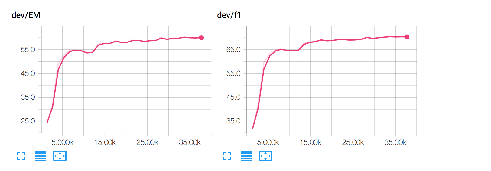

**Work In Progress.**


An unofficial implementation of R-net in PyTorch.

[Natural Language Computing Group, MSRA: R-NET: Machine Reading Comprehension with Self-matching Networks](https://www.microsoft.com/en-us/research/publication/mrc/)


Python 3.5/3.6  and PyTorch 0.41


**Usage**

```
python main.py

```

**Performance**
Currently this implementation only obtained 70.36 F1 score(60.07 EM), so I would like to recommend https://github.com/HKUST-KnowComp/R-Net (Tensorflow) if you are looking for higher performance.



**Implementation Details**
I implemented both addition attention (like the original paper) and dot attention (like HKUST-KnowComp/R-Net).

While both of them are fine with pair encoder, it seems that self matching encoder with addition attention uses too much CUDA Memory. Thus, dot attention is used for self matching encoder.
Also, dot attention is used for pair encoder by default which does not affect performance much but improves training speed largely.


Pair encoder + Addition attention: model/module.py: PairEncoder
Pair encoder + Dot attention: model/module.py: PairEncoderV2

Addition attention for self matching encoder: model/module.py: StaticAddAttention
Dot attention for self matching encoder: model/module.py: StaticDotAttention